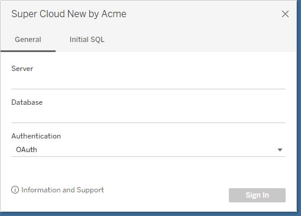
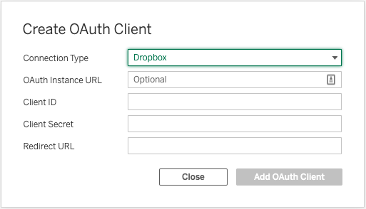
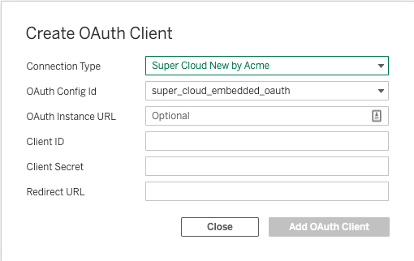
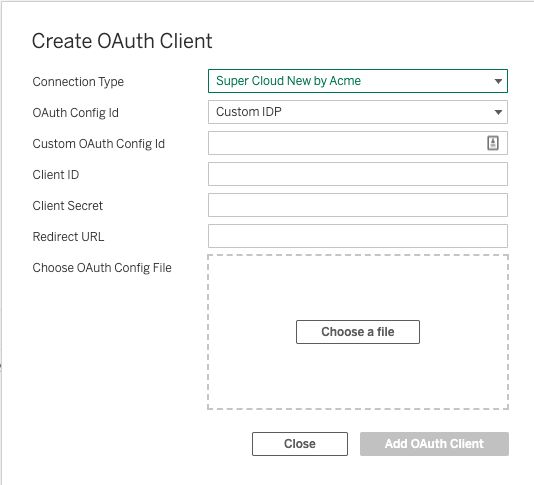
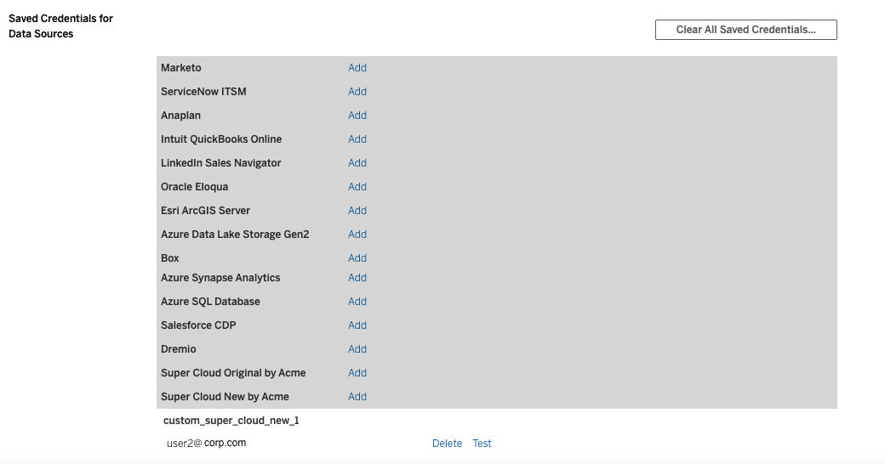

**IMPORTANT:** OAuth for plugins is available in Tableau 2021.1 and newer. Multi-IDP config for plugins is available starting in Tableau 2023.1. 

- [How to Enable OAuth for a Plugin Connector](#how-to-enable-oauth-for-a-plugin-connector)
  - [OAuth Only](#oauth-only)
  - [Multiple Authentication Options](#multiple-authentication-options)
- [The OAuth Config File](#the-oauth-config-file)
  - [XML Elements](#xml-elements)
  - [Response Attribute Mapping](#response-attribute-mapping)
  - [OAuth Capabilities](#oauth-capabilities)
  - [Example OAuthConfig File](#example-oauthconfig-file)
  - [Instance URL/Custom Domain](#instance-urlcustom-domain)
  - [Multiple Embedded OAuth Configs](#multiple-embedded-oauth-configs)
- [OAuth on Tableau Desktop/Tableau Prep](#oauth-on-tableau-desktoptableau-prep)
  - [External/Custom OAuth Configs on Desktop](#externalcustom-oauth-configs-on-desktop)
- [OAuth on Tableau Server & Tableau Online](#oauth-on-tableau-server--tableau-online)
  - [Server Level OAuth Clients](#server-level-oauth-clients)
  - [Site Level OAuth Clients](#site-level-oauth-clients)
    - [Create Site OAuth Client (Pre 2023.1)](#create-site-oauth-client-pre-20231)
    - [Create Site OAuth Client (2023.1+)](#create-site-oauth-client-20231)
- [Site vs Server OAuth Client](#site-vs-server-oauth-client)
  - [Saved Credentials](#saved-credentials)
  - [Desktop Publish flow](#desktop-publish-flow)
  - [Tableau Server Web Authoring flow](#tableau-server-web-authoring-flow)
  
# How to Enable OAuth for a Plugin Connector

First check your database and driver documentation to make sure it supports OAuth. For a complete example please refer to https://github.com/tableau/connector-plugin-sdk/tree/master/samples/scenarios/snowflake_oauth.

To enable OAuth for your connector add an `<oauth-config>` field in the manifest.xml and link to an oauthConfig.xml you created, described below.

```xml
  manifest.xml

  <?xml version='1.0' encoding='utf-8' ?>
  <connector-plugin class=...>
    ...
    <dialect file='dialect.tdd'/>
    <oauth-config file='oauthConfigPing.xml'/>    <!-- add this to to define your OAuth Configs -->
  </connector-plugin>
```

Starting in Tableau 2023.1, you can add multiple OAuth configs, embedded in the plugin. The end users may also provide external/custom OAuth configurations:
- By installing the config files in the Tableau directory. See [Create Site OAuth Client](#create-site-oauth-client-20231)
- By uploading the config for a site level OAuth client. See [External OAuth Config on Desktop](#externalcustom-oauth-configs-on-desktop)

However in both cases, at least one embedded config is still required.

```xml
  manifest.xml

  <?xml version='1.0' encoding='utf-8' ?>

  <connector-plugin class=...>
    ...
    <dialect file='dialect.tdd'/>
    <oauth-config file='oauthConfigPing.xml'/> 
    <oauth-config file='oauthConfigOkta.xml'/>
  </connector-plugin>
```

---
In your *connectionFields.xml* file make sure to add an `authentication` field with a value equal to `oauth`. For example:

## OAuth Only

```xml
    <field name="authentication" label="Authentication" category="authentication" value-type="string" editable="false" default-value="oauth" />
```
## Multiple Authentication Options
```xml
    <field name="authentication" label="Authentication" category="authentication" value-type="selection" default-value="auth-user-pass" >
        <selection-group>
            <option value="auth-user-pass" label="Username and Password"/>
            <option value="oauth" label="OAuth"/>
        </selection-group>
    </field>
```
---
In your *connectionBuilder.js* file you need to use your DB specific logic to handle how to pass in OAuth attributes. Example:

```js

  if (authAttrValue == "oauth")
  {
      params["AUTHENTICATOR"] = "OAUTH";
      params["TOKEN"] = attr["ACCESSTOKEN"];
  }
```
---
In your *connectionResolver.tdr* file, the following related OAuth attributes will be automatically included so you do not need to define them:
```ACCESSTOKEN, REFRESHTOKEN, access-token-issue-time, access-token-expires-in, CLIENTID, CLIENTSECRET, oauth-client, id-token (if any), instanceurl (if any)```
You still need to define other required attributes for your connector; `authentication` and `username` are currently required for OAuth connections so make sure to add them as well.

```xml
<required-attributes>
    <attribute-list>
        <attr>server</attr>
        <attr>dbname</attr>
        <attr>sslmode</attr>
        <attr>authentication</attr>
        <attr>username</attr>
    </attribute-list>
</required-attributes>
```
# The OAuth Config File

The OAuth Config file defines your connector's OAuth configuration and also provides the ability to customize how the OAuth flow should work.

The OAuth Config file ([XSD](https://github.com/tableau/connector-plugin-sdk/blob/master/validation/oauth_config.xsd)) is identified in the main plugin manifest using the `<oauth-config>` element. Here we discuss the structure of this file.

## XML Elements

`<pluginOAuthConfig>`
  is the parent element for all fields below.


| Name  | Type | Meaning | Required? | Notes |
| ----  | ------- | --------- | ----------- | ----------- |
| dbclass | String | The connector class which this OAuth config applies to. | Yes | The dbclass must be same with as the `class` attribute in manifest.xml |
| oauthConfigId | String | Unique ID for this OAuth config | No |  New in Tableau 2023.1. This is a required attribute if there are multiple OAuth configs defined for a connector.
| clientIdDesktop | String | Client ID you registered for Tableau Desktop | No | This is not considered a secret and will be stored in plain text |
| clienSecretDesktop | String | Client Secret you registered for Tableau Desktop | No | This is not considered a secret and will be stored in plain text |
| redirectUrisDesktop | String[] | Redirect Urls for Desktop | No	| Only required when `OAUTH_CAP_FIXED_PORT_IN_CALLBACK_URL` is set to true. This will configure the URL for the authorization response browser redirect. Must be a URL of the form `http://localhost:[portnumber]/Callback`.  This element can be specified multiple times, one for each port. Example: http://localhost:55557/Callback|
| authUri | String | Authorization endpoint URI | Yes | If OAUTH_CAP_SUPPORTS_CUSTOM_DOMAIN is set this is a relative path to the instance URL like `/oauth2/v2.0/authorize`
| tokenUri | String | Token endpoint URI | Yes | If OAUTH_CAP_SUPPORTS_CUSTOM_DOMAIN is set this is a relative path to the instance URL like `/oauth2/v2.0/token`
| userInfoUri | String | User Info UrI | No | If OAUTH_CAP_SUPPORTS_CUSTOM_DOMAIN is set this is a relative path to the instance URL like `/oauth2/v2.0/userinfo`
| instanceUrlValidationRegex | String | Use to validate against your OAuth instance Url. | No | Uses [Java regex pattern](https://docs.oracle.com/en/java/javase/11/docs/api/index.html) syntax, which is similar to PCRE. Example: `^https://(.+\\.)?(myidp.com\\.(com\|us\|cn\|de))(.*)`
| scopes | String[] | scopes | Yes | |
| capabilities |  Map<String, Bool>  | Customizes the OAuth flow | No| See [OAuth Capabilies](#oauth-capabilities) below for details.
| accessTokenResponseMaps |  Map<String, String> | Key value pair that maps an initial token request response attribute <value> to Tableau recognized attribute <key> | Yes | See table below for more info.
| refreshTokenResponseMaps | Map<String, String> | Key value pair that maps a refresh token request response attribute <value> to Tableau recognized attribute <key> | No | If not defined will use accessTokenResponseMaps by default | 
<br>

## Response Attribute Mapping
The XML elements *accessTokenResponseMaps* and *refreshTokenResponseMaps* define a relationship between Tableau field names to fields in the authorization server response. For example this maps Tableau's `ACCESSTOKEN` field to `access_token` in the authorization server response.

```
    <entry>
        <key>ACCESSTOKEN</key>
        <value>access_token</value>
    </entry>
```

| Tableau Name | Required for accessTokenResponseMaps | Required for refreshTokenResponseMaps | Notes |
| ----  | ------- | --------- |  ----------- |
| ACCESSTOKEN | Yes | Yes | Access token. Short lived. |
| REFRESHTOKEN | Yes | No | Refresh token. Long lived. Used to refresh access token. |
| username | Yes | No | Used by Tableau to identify the token. |
| access-token-issue-time | No | No | Defaults to the time when the token is sent to Tableau |
| access-token-expires-in | No | No | Default 3600 seconds |
| id-token | No | No | If you have openid as your scope this field is returned and can be used to retrive userinfo. Use together with OAUTH_CAP_SUPPORTS_GET_USERINFO_FROM_ID_TOKEN |
| [your own field] | No | No | It is usually not needed to define your own field, and this field will not be able to participate in any OAuth flow. |

<br>

## OAuth Capabilities

This set of OAuth Config capabilities is not shared with the regular connector capabilities.

| Capability Name  | Description | Default | Recommendation |
| ----  | ------- | --------- | ----------- |
| OAUTH_CAP_SUPPORTS_CUSTOM_DOMAIN | Enable this if your IDP has different URLs. The OAuth config will specify the relative paths for the URLs, and the end user will have to provide the IDP hostname when creating a new connection. | false | - |
| OAUTH_CAP_REQUIRE_PKCE | Whether your OAuth provider supports PKCE, more details: https://oauth.net/2/pkce/ | false | true |
| OAUTH_CAP_PKCE_REQUIRES_CODE_CHALLENGE_METHOD | Whether your OAuth provider PKCE requires code_challenging_method passed in. If set to true, we are using S256 by default. | false | true |
| OAUTH_CAP_SUPPORTS_STATE | Used to protect against CSRF attacks, more details: https://auth0.com/docs/protocols/state-parameters | false | true |
| OAUTH_CAP_GET_USERNAME_USES_POST_REQUEST | Only use if you define a USERINFO_URI in oauthConfig file to retrieve the userinfo in a separate request | false | - |
| OAUTH_CAP_CLIENT_SECRET_IN_URL_QUERY_PARAM | Use this if Client secrets are expected in the query parameter instead of the request header. | false | - |
| OAUTH_CAP_FIXED_PORT_IN_CALLBACK_URL | Only relevant for desktop apps (Tableau Desktop and Prep). Use this when your authorization server doesn't allow dynamic port ranges for localhost/native apps. | false | - |
| OAUTH_CAP_SUPPORTS_HTTP_SCHEME_LOOPBACK_REDIRECT_URLS | Only relevant for desktop apps (Tableau Desktop and Prep). When enabled the desktop app callback will use loopback address instead of "localhost". Not compatible with OAUTH_CAP_FIXED_PORT_IN_CALLBACK_URL. For more info see https://developers.google.com/identity/protocols/oauth2/native-app | false | - |
| OAUTH_CAP_REQUIRES_PROMPT_CONSENT | Add prompt=consent to the request. | false | - |
| OAUTH_CAP_REQUIRES_PROMPT_SELECT_ACCOUNT | Add prompt=select_account to the request. More details: https://docs.microsoft.com/en-us/azure/active-directory/develop/v2-oauth2-auth-code-flow | false | - |
| OAUTH_CAP_SUPPORTS_GET_USERINFO_FROM_ID_TOKEN | Used when your OAuth response contains a JWT style ID_TOKEN that can be parsed out to get actual username. For example, https://docs.microsoft.com/en-us/azure/active-directory/develop/id-tokens | false | - |

---
## Example OAuthConfig File
**oauthConfig.xml**

```xml
<?xml version="1.0" encoding="utf-8"?>
<pluginOAuthConfig>
    <!-- dbclass must correspond to the class registered in manifest.xml -->
    <dbclass>my-connector-class</dbclass>

    <clientIdDesktop>client-id-1234</clientIdDesktop>
    <clientSecretDesktop>xyz-456-000</clientSecretDesktop>

    <!-- Desktop redirectUri, only needed if your authorization server doesn't allow dynamic ports in localhost redirect. -->
    <redirectUrisDesktop>http://localhost:55556/Callback</redirectUrisDesktop>
    <redirectUrisDesktop>http://localhost:55557/Callback</redirectUrisDesktop>
    <redirectUrisDesktop>http://localhost:55558/Callback</redirectUrisDesktop>
    <redirectUrisDesktop>http://localhost:55559/Callback</redirectUrisDesktop>
    <redirectUrisDesktop>http://localhost:555510/Callback</redirectUrisDesktop>

    <!-- authUri and tokenUri only contains the relative path since this example has OAUTH_CAP_SUPPORTS_CUSTOM_DOMAIN enabled. -->
    <authUri>/oauth/authorize</authUri>
    <tokenUri>/oauth/token-request</tokenUri>

    <instanceUrlValidationRegex>^https:\/\/(.+\.)?(supercloud\.(com|us|cn|de))(.*)</instanceUrlValidationRegex>
    <scopes>refresh_token</scopes>
    <scopes>profile</scopes>
    <scopes>email</scopes>
    <capabilities>
        <entry>
            <key>OAUTH_CAP_PKCE_REQUIRES_CODE_CHALLENGE_METHOD</key>
            <value>true</value>
        </entry>
        <entry>
            <key>OAUTH_CAP_SUPPORTS_CUSTOM_DOMAIN</key>
            <value>true</value>
        </entry>
        <entry>
            <key>OAUTH_CAP_REQUIRE_PKCE</key>
            <value>true</value>
        </entry>
        <entry>
            <key>OAUTH_CAP_FIXED_PORT_IN_CALLBACK_URL</key>
            <value>true</value>
        </entry>
        <entry>
            <key>OAUTH_CAP_PKCE_REQUIRES_CODE_CHALLENGE_METHOD</key>
            <value>true</value>
        </entry>
    </capabilities>

    <!-- Map Tableau recognized attribute "key" to OAuth response attribute "value" -->
    <accessTokenResponseMaps>
        <entry>
            <key>ACCESSTOKEN</key>
            <value>access_token</value>
        </entry>
        <entry>
            <key>REFRESHTOKEN</key>
            <value>refresh_token</value>
        </entry>
        <entry>
            <key>access-token-issue-time</key>
            <value>issued_at</value>
        </entry>
        <entry>
            <key>access-token-expires-in</key>
            <value>expires_in</value>
        </entry>
        <entry>
            <key>username</key>
            <value>username</value>
        </entry>
    </accessTokenResponseMaps>

    <!-- No refreshTokenResponseMaps needed since it's the same as accessTokenResponseMaps -->
 </pluginOAuthConfig>

```

## Instance URL/Custom Domain
Some IDPs have a single global endpoint, such as https://accounts.google.com/o/oauth2/. Others have different instances, for example Okta would have a different instance URL for each customer. If your authorization server or IDP has different instances, then enable OAUTH_CAP_SUPPORTS_CUSTOM_DOMAIN. In this case the end users will be prompted for the URL when connecting.

## Multiple Embedded OAuth Configs
*\*Available starting in Tableau 2023.1*

The plugin developer may add multiple embedded OAuth configs to the plugin starting in Tableau 2023.1. Each should have a new element `<oauthConfigId>`. This should be unique and is displayed in the UI. The user will be prompted to select from the available configurations when creating a connection. 



OAuth configs may also be specified independent of the plugin using site-level OAuth clients or by installing in the Tableau directory for desktop applications. See below for more information.

# OAuth on Tableau Desktop/Tableau Prep
Tableau Desktop uses a shared client ID and client secret which is embedded in the plugin. It also uses localhost callbacks to receive the authorization code response. The plugin developer (or whoever provides the OAuth config) must ensure that the localhost or loopback callback URLs are configured on the whitelist for the authorization server.

If the authorization server supports dynamic port ranges for native applications then that should be used. This is the default behavior for Tableau OAuth clients. For example `http://localhost:*/Callback`.

If the authorization server does not support this, then enable OAUTH_CAP_FIXED_PORT_IN_CALLBACK_URL, and specify a set of `<redirectUrisDesktop>` in the OAuth config. The redirectUrisDesktop must be of the form `http://localhost:[portnumber]/Callback`. If you need to use loopback address, you can enable OAUTH_CAP_SUPPORTS_HTTP_SCHEME_LOOPBACK_REDIRECT_URLS, but the `<redirectUrisDesktop>` should still specify localhost. The callback at runtime will be rewritten to something like http://127.0.0.1:55555/Callback.

For more information on see [RFC 8252: Loopback Interface Redirection](https://datatracker.ietf.org/doc/html/rfc8252#section-7.3).

## External/Custom OAuth Configs on Desktop
*\*Available starting in Tableau 2023.1*

The end user or admin can specify custom OAuth configs for desktop applications, independent of the plugin connector. These should be installed in `My Tableau Repository/OAuthConfigs` or `My Tableau Prep Repository/OAuthConfigs`. They must define the new field `oauthConfigId`. The user will be prompted to select from available configs when creating the connection.

# OAuth on Tableau Server & Tableau Online

## Server Level OAuth Clients
**This is an older approach that may not work for plugins with with multiple OAuth configs. In most cases [Site Level OAuth Clients](#site-level-oauth-clients) are preferred.**

You need to configure the OAuth client on server for all connectors using saved credentials (aka Custom OAuth), which includes all plugins. Execute the following command, substituting the values for your OAuth client.
```
tsm configuration set -k oauth.config.clients -v "[{\"oauth.config.id\":\"[dbclass]\", \"oauth.config.client_id\":\"[client_id]\", \"oauth.config.client_secret\":\"[client_secret]\", \"oauth.config.redirect_uri\":\"[redirect_url]\"}]" --force-keys
```
The value `dbclass` should match that configured in the plugin manifest and OAuthConfig.xml. The `client_id`, `client_secret`, and `redirect_uri` should be provided by your authorization server. The `redirect_url` needs to follow certain format, if your Tableau Server URL is https://myserver/ then `redirect_uri` needs to be https://myserver/auth/add_oauth_token.


## Site Level OAuth Clients
The preferred way to configure OAuth is using site level OAuth clients. These are configured by the server admin for Tableau Server, or site admin for Tableau Online. For an example of configuring an Azure AD OAuth client on a site: https://help.tableau.com/current/server/en-us/config_oauth_azure_ad.htm.  

The OAuth clients will only be effective for a particular site, and will not not require a restart. They will take take precedence over the server-level OAuth clients if any. For each site, there is only one OAuth client allowed for each OAuth config.

### Create Site OAuth Client (Pre 2023.1)


### Create Site OAuth Client (2023.1+)
Starting in Tableau 2023.1, you can have multiple OAuth configs for a connector. These may be embedded or external/custom.

To create a client for an embedded config, select the config ID.



<br>
To create a client for an custom config, upload the config XML file.



# Site vs Server OAuth Client

| Feature | Server-Wide OAuth Clients | Site-Wide OAuth Clients |
| ----  | ------- | --- |
| Configuration Mechanism | TSM command run by server admin | Web UI by  site admin (Tableau Online) or server admin (Tableau Server)|
| Restarts | Need restart server| No need to restart server|
| Availability |Apply to whole server| Only apply to the particular site, will not affect other sites|
| Precedence | - | Take precedence over server-level OAuth Clients if both exist |

## Saved Credentials
To add an OAuth credential on Tableau Server, go to **My Account Settings** page, look for your connector in the **Saved Credentials For DataSources** Section.
After successfully adding your credential you will notice an entry appear under your connector. In this case the OAuth config ID is shown along with the username. In some cases the instance-url may also be shown.



## Desktop Publish flow

When publishing an OAuth connection to Tableau Server, you will see multiple auth options:
- **Prompt** means this resource will published without embedding credential, viewers would need to provide credential to access the resource.
- **Embedding [username]** means you will embed the credential to this resource, so all the viewer can use the same credential to access the resource. Note in order for this to show up, you must already have added a saved OAuth credential according to previous section. You would see multiple entries if you have multiple records of saved credentials and you can pick which one you want to use for embedding.
- **Embed Password** is not a supported auth mechanism for plugin OAuth connections and an error will show up if you choose that option.

## Tableau Server Web Authoring flow

For Web Authoring, the UI dialog will be same as Tableau Desktop. The difference will be that we are using the server OAuth clients. The server or site admin must configure the OAuth client information (client ID, client secret, etc) beforehand for this to succeed.
